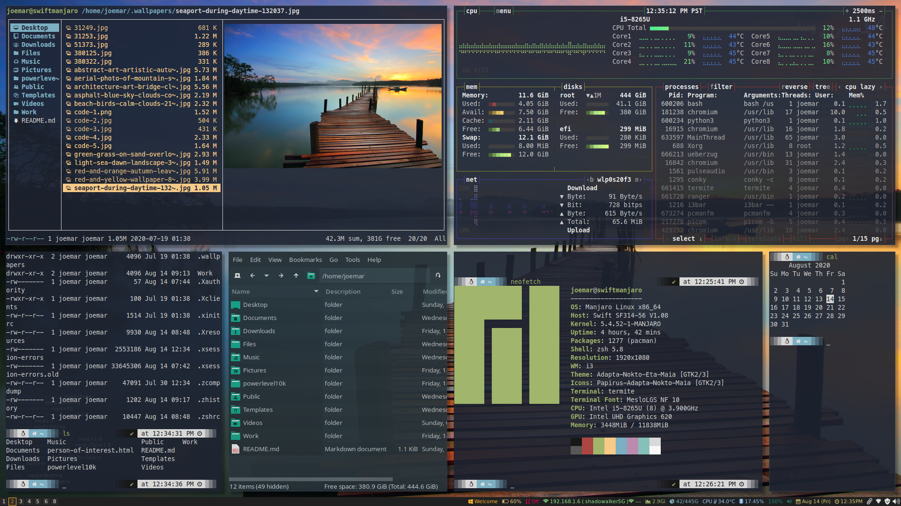

# Dotfiles

Dotfiles are the customization files that are used to personalize your Linux or other Unix-based system.  You can tell that a file is a dotfile because the name of the file will begin with a period--a dot!  The period at the beginning of a filename or directory name indicates that it is a hidden file or directory. This repository contains my personal dotfiles.  They are stored here for convenience so that I may quickly access them on new machines or new installs.

---

A great place to start is "Your unofficial guide to dotfiles on [GitHub](https://dotfiles.github.io/)".

I use the git bare repository method for managing my dotfiles: [The best way to store your dotfiles: A bare Git repository](https://developer.atlassian.com/blog/2016/02/best-way-to-store-dotfiles-git-bare-repo).

# License
The files and scripts in this repository are licensed under the MIT License, which is a very permissive license allowing you to use, modify, copy, distribute, sell, give away, etc. the software.  In other words, do what you want with it.  The  only requirement with the MIT License is that the license and copyright notice must be provided with the software.
